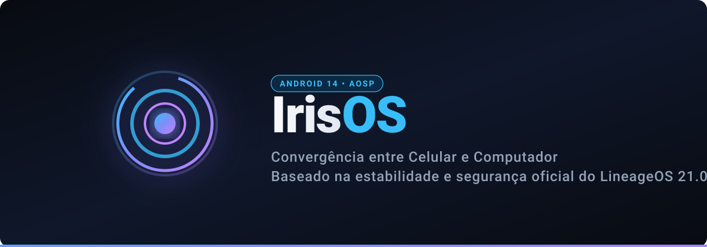

# 🌌 IrisOS

<p align="center">
  
</p>

<p align="center">
  <b>Um sistema operacional moderno baseado em Android 14 (LineageOS 21), unificando a experiência entre Celular e Computador.</b>
</p>

<p align="center">
  <a href="#-visão-geral"></a>
  <a href="#-alvos-suportados"></a>
  <a href="https://github.com/miguel7435987984/IrisOS/actions"></a>
  <a href="#-licença"></a>
</p>

---

## 📖 Visão Geral

O **IrisOS** é uma Custom ROM focada em design elegante, estabilidade, privacidade e convergência. O projeto é dividido em dois ecossistemas complementares:

* 📱 **IrisOS Mobile (`arm64`):** Uma experiência fluida e limpa para smartphones, com suporte dedicado ao **Redmi Note 13 Pro 5G (`garnet`)** e suporte genérico via **GSI (Treble)**.
* 💻 **IrisOS PC (`x86_64`):** Um sistema operacional completo para PCs e notebooks (Intel/AMD), gerado em formato **ISO bootável** com modo Live, instalador em dual boot, aceleração gráfica via Mesa3D e interface adaptada para mouse, teclado e janelas livres (*freeform*).

---

## 🎯 Alvos Suportados

| Alvo | Codename / Arch | Base | Formato de Saída |
| :--- | :--- | :--- | :--- |
| **Redmi Note 13 Pro 5G / Poco X6 5G** | `garnet` (`arm64-v8a`) | LineageOS 21.0 | Arquivo `.zip` instalável via Recovery |
| **IrisOS PC (Intel / AMD)** | `x86_64` | Android-x86 / BlissOS / LineageOS | Imagem híbrida `.iso` bootável |
| **Generic System Image (GSI)** | `arm64-ab` | LineageOS 21.0 + Treble Patches | Imagem `system.img` flashável via Fastboot |

---

## 📂 Estrutura do Repositório

```text
IrisOS/
├── .github/
│   └── workflows/
│       └── build-irisos.yml       # Pipeline automatizado de compilação via GitHub Actions
├── manifests/
│   ├── default.xml                # Manifesto base do LineageOS 21.0
│   ├── garnet.xml                 # Árvores de dispositivo, kernel e vendor para o Redmi Note 13 Pro 5G
│   └── pc_x86_64.xml              # Componentes de boot UEFI, Mesa3D e kernel x86
├── vendor_iris/                   # Identidade, propriedades ro.iris.*, temas e overlays
│   ├── config/
│   │   ├── common.mk              # Configurações globais da ROM
│   │   ├── version.mk             # Definição de versão e tipo de build
│   │   └── branding.mk            # Configurações de bootanimation e recursos visuais
│   └── overlay/                   # RRO Overlays para Configurações, SystemUI e Framework
└── scripts/
    ├── setup-host.sh              # Script para instalar dependências e preparar a máquina
    └── build.sh                   # Script de compilação unificado para Mobile e PC
```

---

## 🚀 Como Compilar

### Opção 1: Via GitHub Actions (Recomendado)
Você pode disparar a compilação diretamente pelo GitHub (ou pelo app do celular):
1. Vá até a aba [**Actions**](https://github.com/miguel7435987984/IrisOS/actions) deste repositório.
2. Selecione o workflow **"Build IrisOS"**.
3. Clique em **"Run workflow"**, selecione o alvo desejado (`garnet`, `pc-x86_64` ou `gsi-arm64`) e o tipo de build (`userdebug` ou `user`).
4. Ao concluir, o arquivo `.zip` ou `.iso` será disponibilizado automaticamente na seção de **Releases**!

### Opção 2: Compilação Manual (Local)

#### 1. Preparar o ambiente
```bash
bash scripts/setup-host.sh
```

#### 2. Compilar para o Redmi Note 13 Pro 5G (`garnet`)
```bash
bash scripts/build.sh garnet userdebug
```

#### 3. Compilar a ISO para PC (`x86_64`)
```bash
bash scripts/build.sh pc-x86_64 userdebug
```

### 🖥️ Testar no PC via QEMU (Sem Instalação / Modo Live)
Você pode testar o IrisOS PC em uma janela virtual com aceleração KVM sem tocar no seu disco físico:
```bash
bash scripts/run-qemu.sh [caminho/para/IrisOS-x86_64.iso]
```
> Na tela inicial do GRUB, basta selecionar a opção **"Live CD - Run IrisOS without installation"**. O sistema rodará 100% na memória RAM!

---

## ⚙️ Identidade do IrisOS (`vendor/iris`)

<p align="center">
  
  <br/>
  <sub><i>Animação de inicialização oficial do IrisOS com anéis em órbita contínua e núcleo pulsante.</i></sub>
</p>

As compilações do IrisOS definem as seguintes propriedades no sistema:
* `ro.iris.version` — Versão atual do IrisOS (ex: `1.0-alpha`).
* `ro.iris.build.type` — Tipo de release (`official`, `community` ou `nightly`).
* `ro.iris.device` — Aparelho ou arquitetura de destino (`garnet` ou `x86_64`).
* `ro.iris.display.version` — Nome de exibição nas configurações do sistema.

---

## 📜 Licença

O IrisOS é distribuído sob a licença [Apache 2.0](LICENSE). Código herdado do AOSP e LineageOS mantém suas respectivas licenças originais.
